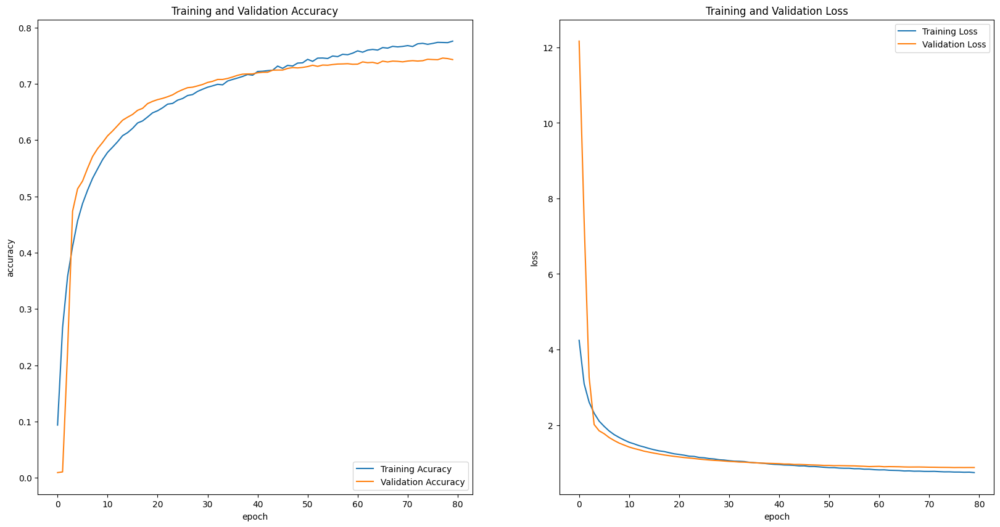
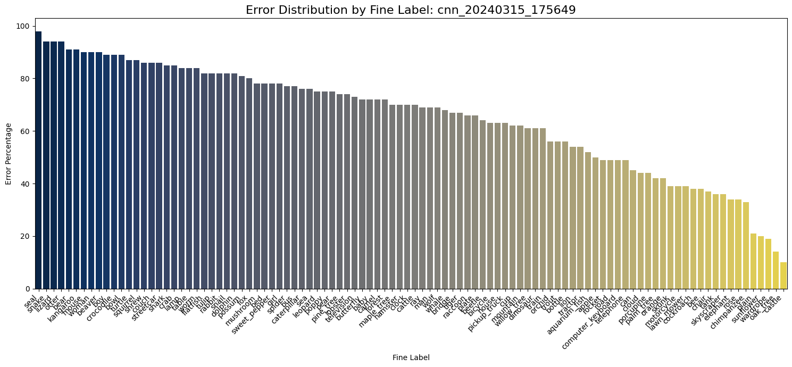

# Deep-Learning-CIFAR-100

This repository summarizes and builds on a Computer Vision project I completed while earning my Master of Science in Data Science. First, I will briefly outline the CIFAR-100 dataset. Then I will discuss how we tested different models during our school project, our baseline model, and how, after completing the project, I successfully solved the early plateauing issues we experienced by adjusting the callbacks. 

## Repository Contents

1. Original CIFAR100 Jupyter notebook from school project (CIFAR100_Original_Project.ipynb)
2. Updated Jupyter notebook from my attempts to improve models (CIFAR100_Revisted.ipynb)
3. Testing notebook for use with H5 files (CIFAR100_testing.ipynb)
4. Images folder with visualizations. 

## CIFAR-100

CIFAR-100 is a commonly used dataset for training and evaluating computer vision algorithms, specifically those focused on image classification. Here's a quick breakdown:

Size and Content: It comprises 60,000 small (32x32 pixel) color images of 100 fine classes and 10 coarse classes. 

Structure: The dataset is split into 50,000 training and 10,000 test images. Thus, each class has 600 images, divided into 500 training and 100 testing images. 

Below is a sampling of images from the dataset:

## Problem Set Up

The CIFAR100 has a companion dataset, the CIFAR10. It is also 60,000 color images but has only 10 classes with no overlap. Simple CNN models handle the CIFAR10 well. However, due to the additional complexity of the classes, a more robust model is necessary to handle the CIFAR100. 

## Baseline Model 

ResNet models utilize the concept of residual blocks, which allow the neural net to skip over certain layers using shortcuts. This particular ResNet comes directly from TensorFlow: TensorFlow.keras.applications.resnet50. The model I ran uses stochastic gradient descent as an optimizer and has 50 layers. 

I ran ResNet50 in Colab using both an L4 and an A100 GPU, taking 4 and 2 hours, respectively. Below are the accuracy and loss metrics. Based on preset callbacks, the learning rate was reduced once. 

## Workflows Developed in School

In school, we noticed that keeping track of model performance was difficult. So, we (thank you, Corey Munk) developed the following workflows to better track what worked and what did not. This included performance and model tracking in the form of visualizations and CSV files. We also implemented workflows to save models as H5 files so we could use them again later. 

## Initial Attempts to Tune

Our initial tuning phase was marked by challenges with excessively overfitting models, which had simple architecture and efficient run times. Our goal in this initial phase was to become acquainted with using the Keras sequential layers to architect our models and all the parameters we could leverage for model tuning. Here is an example of one of our initial model's architectures:

These models seemed to hit a ceiling of around 35% accuracy despite incorporating multiple 2D convolutional layers, max-pooling layers, a dropout layer to help prevent overfitting, a flattening layer to take the multidimensional outputs from previous layers, and a fully connected (dense) output layer with softmax.

We decided to look at which classes were causing the most problems. Below are pictures of those with the highest error rates. 

During the intermediate phase of our model tuning we began experimenting with image augmentation, adding additional layers, and manipulating the number of filters with each layer. Utilizing image augmentation eliminated and dropout layers at the end of the architecture solved overfitting. 

We also tried stacking three convolutional layers together at the beginning of the model. While this method improved performance compared to the initial phase, it did not yield results to justify the additional time and computational expense. 

## Fine Tuning 1

For our final model tuning phase, we wanted to see if it could improve accuracy on the classes the model struggled with, such as otter, squirrel, bear, and seal. Since these classes appear to have similar feature patterns, we decided to add more depth to our network but also wanted to keep the total number of parameters equal to or less than our previous intermediate models. We did this by doing the following:

1. We limited the number of convolutional layers we had one after another to two vs. the three we had used in the previous models, which helped us keep the total number of parameters down. This helped with computational efficiency and controlled model complexity.

2. We followed these double convolution layers with a batch normalization layer, a max pooling layer, and a dropout layer. This gave us the added depth in the model while controlling the number of parameters allowing for more efficient computation. 

3. We removed one of the dense layers at the end of the model, which greatly reduced the total number of parameters, making our model even more computationally efficient.

This strategy ultimately led to a model giving us an accuracy of 57%, the highest validation accuracy we had seen in our tuning process.

## Fine Tuning 2

One of the primary questions I had when completing this project for school was whether we could improve accuracy and loss metrics by adjusting the callbacks and image augmentation. I noticed the training and validation data were not converging, yet the models were plateauing. This told me that our models might be learning less than they could. 

After trial and error, to gain further intuition, I added code to our notebook to save both image augmentation and callback information so I could get concrete data on what was working and what wasn't. Regarding image augmentation, the most effective adjustment I made was replacing a sheer range adjustment with a vertical flip. Regarding callbacks, increasing the model's patience and decreasing the learning rate reduction worked the best. 

Doing this allowed me to increase our original model's performance from 57% to 64%. I also tried it on one of the simpler models I had built on my own, and it increased its accuracy from 50% to 57% (with inferior loss values, though). 

Looking at error rates by image class was instructive. While the otter fine label was still problematic, error rates for seals, for example, were significantly improved. Moreover, error rates for the most difficult coarse labels significantly declined. 

Key Lessons

1. Do not focus solely on model architecture to solve overfitting and plateauing issues. Adjusting callbacks can have a significant effect on performance. 

2. Too much image augmentation or the wrong kind will limit your model's learning. Learning rate reductions can be used to optimize model performance but must be done thoughtfully. During this process, I noticed fewer yet more well-timed learning rate reductions. 

3. As expected, my models performed better when training and validation metrics converged. By implementing these changes, our relatively lightweight (60-70 MB H5 files) models could come close to the out-of-the-box ResNet50 (250 MB), which served as a baseline. Instead of taking hours to run, these models were completed in under 40 minutes. 

5. Notably, you can run the same architecture and callbacks and get noticeable differences in model performance. 

6. Tracking neural net performance generates a lot of data. Developing workflows to monitor model performance was helpful. However, to save time in the future, I would use something like ML Flow.
